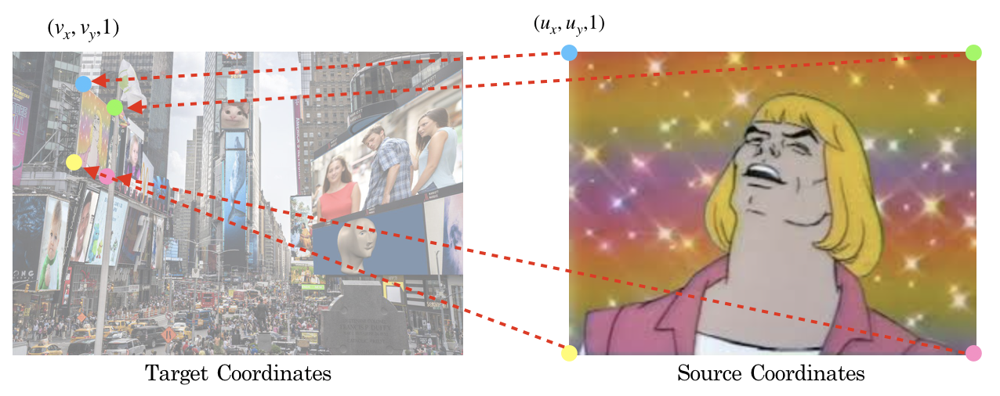
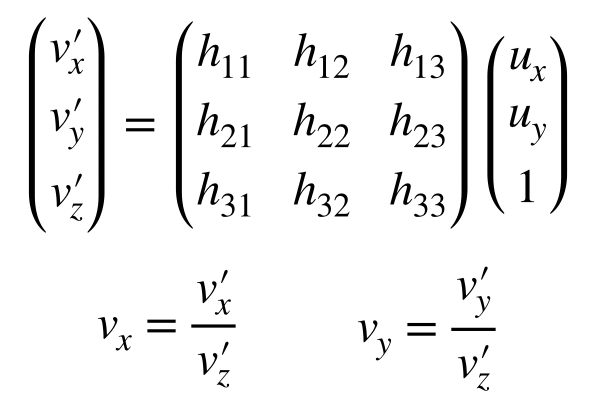
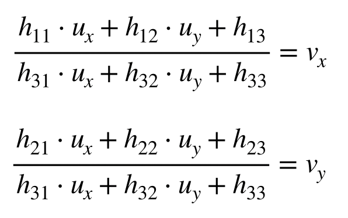
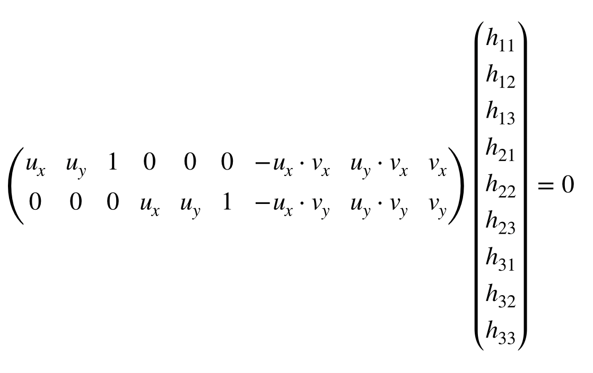

# homography

The meme square with projection geometry.


## Usage
The main algorithm is in `homography/main.py`. To process the images, you need to specify custom parameters in `homography/config.yaml` file:
- `canvas_image`: file path of the background canvas image
- `project_images`: list of file paths of the images to project onto the canvas
- `output_image`: file path of the output image
- `coors`: a list of quadrilateral corners in canvas coordinates. Should be same length as `project_images`. Note that in the config file, `x` is defined as the vertical axis, while `y` is the horizontal axis.

```
This pixel is (x, y) = (5, 2).
 __ __ __ __ __ __ __ y (width)
|__|__|__|__|__|__   
|__|__|__|__|__|__   
|__|__|__|__|__|__   
|__|__|__|__|__|__   
|__|██|__|__|__|__
|__|__|__|__|__|__   
|
x (height)
```

Referring to `homography/config.yaml`, the four corners of image `1.jpg`, starting from top-left in clockwise order, will be projected to the first entry of `coors`, which are four canvas coordinates:
```yaml
coors:
  - top_left: 
      x: 296.3452162756598
      y: 795.149285190616
    top_right:
      x: 49.88489736070392
      y: 1194.9957844574778
    bottom_right:
      x: 346.23295454545456
      y: 1197.9741568914956
    bottom_left:
      x: 460.90029325513194
      y: 799.6168438416423
```

After modifying `config.yaml`, simply run:
```
python3 main.py
```
in `homography/`. You can also try out the demo `config.yaml` provided, using images in `data/`.
   
## How this works
### Homography
Projecting a 2D image onto another image (the "canvas") involves computing the tranformation between two homogeneous coordinate systems. We refer to the coordinate system of the image to project as the **source coordinates**, and the coordinate system of the canvas as the **target coordinates**.



Suppose a point `(u_x, u_y, 1)` in the source coordinate is projected to a point in `(v_x, v_y, 1)` in target coordinates, we can represent the projection as a **homography** **H**, which is a 3*3 matrix.



Since H is *invariant to scaling*, we usually constrain **h_33 = 1** so that **H** has 8 degree of freedom (DoF) rather than 9. Another way to enforce 8 DoF is constraining the squared sum of all elements in **H** to be 1 (which turns out to be a more robust constraint).

### Solving H
To solve **H**, we need 8 equations since **H** has 8 DoF. This is equivalent to 4 pairs of mappings between source and target coordinates(4 points define a homography). We can simply choose the four corners of the source image and its expected transformed target coordinates to construct our equations.
  
For each homogeneous coordinate mapping `(u_x, u_y, 1) -> (v_x, v_y, 1)`, we can write down two equations:



Writing in matrix multiplication form:



Since we have 4 pairs of coordinate mappings, we can stack all 2 * 9 matrices into a single 8 * 9 matrix **A**, and solve the homogeneous system:
```
Ah = 0, subject to ||h|| = 1
```
We solve **h** by performing [singular value decomposition](https://en.wikipedia.org/wiki/Singular_value_decomposition) on **A**<sup>T</sup>**A**. **h** would be the eigenvector corresponding to the smallest eigenvalue.