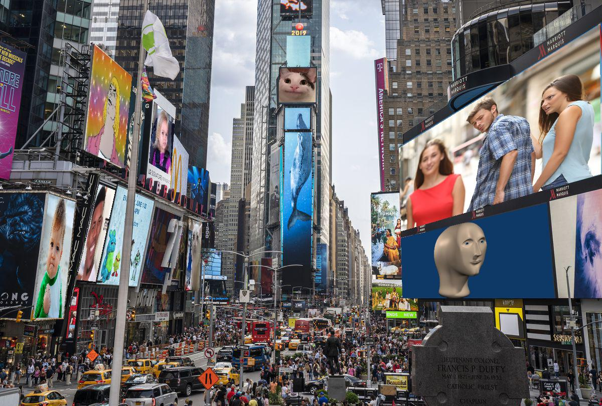

# homography

The meme square with projection geometry.



## Usage
The main algorithm is in `homography/main.py`. To process the images, you need to specify custom parameters in `homography/config.yaml` file:
- `canvas_image`: file path of the background canvas image
- `project_images`: list of file paths of the images to project onto the canvas
- `output_image`: file path of the output image
- `coors`: a list of quadrilateral corners in canvas coordinates. Should be same length as `project_images`. Note that in the config file, `x` is defined as the vertical axis, while `y` is the horizontal axis.

```
This pixel is (x, y) = (5, 2), following numpy's format of (h, w).
 __ __ __ __ __ __ __ y (width)
|__|__|__|__|__|__   
|__|__|__|__|__|__   
|__|__|__|__|__|__   
|__|__|__|__|__|__   
|__|██|__|__|__|__
|__|__|__|__|__|__   
|
x (height)
```

Referring to `homography/config.yaml`, four corners of the image `1.jpg`, starting from the origin in clockwise order, will be projected to the first entry of `coors`, which are four canvas coordinates:
```yaml
coors:
  - top_left: 
      x: 296.3452162756598
      y: 795.149285190616
    top_right:
      x: 49.88489736070392
      y: 1194.9957844574778
    bottom_right:
      x: 346.23295454545456
      y: 1197.9741568914956
    bottom_left:
      x: 460.90029325513194
      y: 799.6168438416423
```

After modifying `config.yaml`, simply run:
```
python3 main.py
```
in `homography/`. You can also try out the demo `config.yaml` provided, using images in `data/`.
   
## How this works

